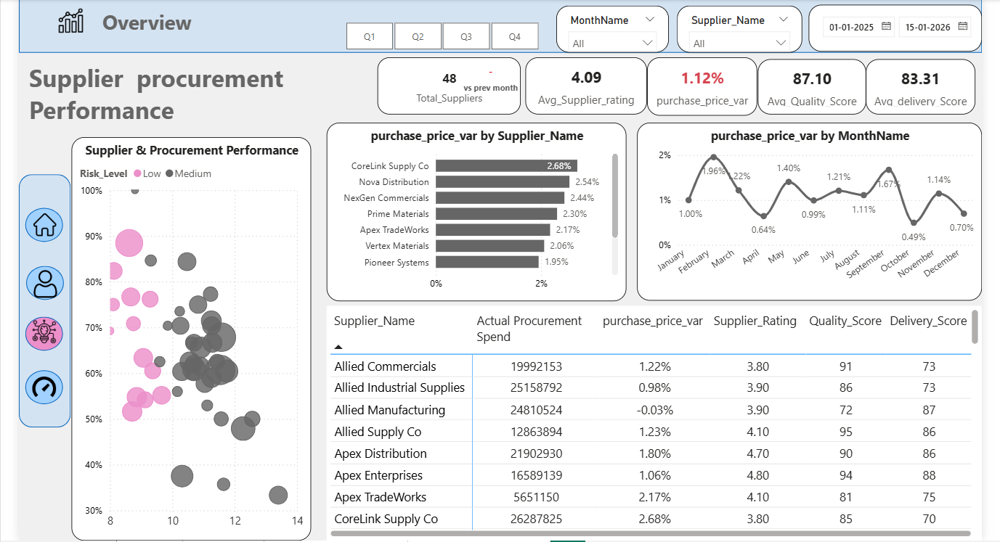
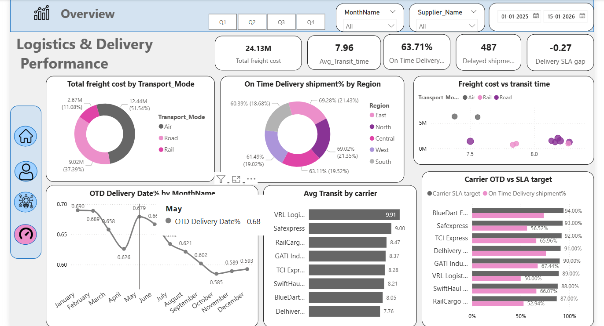

# 🚚 Supply Chain Analytics Dashboard

A dynamic **Power BI dashboard** designed to analyze procurement, supplier performance, quality, logistics, and delivery operations.

The **Supply Chain Analytics Dashboard** provides a 3-page interactive view of procurement spend, supplier risk, delivery performance, and logistics costs. It helps stakeholders identify cost variances, supplier issues, delivery delays, and carrier performance gaps.

## 🚀 Live Dashboard

🔗 **[View Live Supply Chain Analytics Dashboard](https://app.powerbi.com/reportEmbed?reportId=730cb13d-2d63-4a32-bf23-6365d9b6ef19&autoAuth=true&ctid=56c1d497-700b-49cf-8f8d-3dd6b20d522f)**
---
## 🛠️ Tech Stack

- 📊 **Power BI Desktop** – Dashboard development and visualization
- 📂 **Power Query** – Data cleaning and transformation
- 🧠 **DAX** – KPIs and business calculations
- 🔗 **Data Modeling** – Relationships between procurement, supplier, category, date, and logistics data
- 📁 **File Format** – `.pbix` for the Power BI project

## 📂 Data Source

The dashboard uses operational **supply chain data** covering:

- Purchase orders and PO lines
- Supplier information
- Product/category data
- Shipment records
- Carrier information
- Warehouse/logistics data
- Monthly procurement targets

### 💼 Business Problem

Supply chain data is often distributed across procurement, supplier, shipment, and logistics records, making it difficult to quickly identify cost overruns, supplier risks, quality issues, and delivery delays.

### 🎯 Goal of the Dashboard

To provide a single analytical view that helps users:

- Monitor procurement spend vs target
- Evaluate supplier performance
- Identify pricing variance
- Track quality and rejection rates
- Measure on-time delivery
- Compare carrier performance against SLA
- Analyze freight costs and transport modes

## 📊 Dashboard Pages

### 1. Overview
Provides an executive-level view of overall supply chain performance — procurement spend, purchase orders, supplier risk, quality, and delivery performance.

**Key visuals:**
- Actual Procurement Spend, Total Purchase Orders, Rejection Rate, On-Time Delivery %, and Average Lead Time KPIs
- Actual vs Target Procurement Spend
- Purchase Order Status
- Supplier Risk Level
- Spend Variance by Product Category
- Delivery Delay Analysis

### 2. Supplier & Procurement Performance
Analyzes supplier performance, procurement pricing, quality, and delivery effectiveness.

**Key visuals:**
- Total Suppliers, Average Supplier Rating, Purchase Price Variance %, Average Quality Score, and Average Delivery Score KPIs
- Supplier & Procurement Performance analysis
- Purchase Price Variance by Supplier
- Monthly Purchase Price Variance trend
- Supplier performance detail table
- Actual Procurement Spend by Supplier

### 3. Logistics & Delivery Performance
Analyzes transportation costs, carrier performance, transit time, and delivery reliability.

**Key visuals:**
- Total Freight Cost, Average Transit Time, On-Time Delivery %, Delayed Shipments, and Delivery SLA Gap KPIs
- Freight Cost by Transport Mode
- On-Time Delivery % by Region
- Freight Cost vs Transit Time
- Monthly On-Time Delivery trend
- Average Transit Time by Carrier
- Carrier On-Time Delivery % vs SLA Target

💰 Procurement Spend: ₹891.9M below target, indicating controlled procurement spending and an opportunity to optimize budget utilization further.
🚚 On-Time Delivery: 63.7% of deliveries are completed on time, highlighting a significant opportunity to improve delivery reliability and supply chain efficiency.
📦 Quality Performance: The overall rejection rate is only 0.82%, indicating strong supplier quality and effective quality control.
⏱️ Average Lead Time: The average procurement/delivery lead time is 10.43 days, providing an opportunity to shorten cycle times and improve operational responsiveness.
🏭 Supplier Risk: 73% of suppliers are classified as Medium Risk, making supplier monitoring, risk mitigation, and performance improvement important priorities.
🚛 Transportation Delays: Road shipments dominate delivery delays, indicating that road carriers and transportation processes should be closely monitored to improve SLA performance.
📊 Supplier Management: The high 73% Medium-Risk supplier concentration suggests the need for regular supplier performance reviews and proactive risk management.
🎯 Operational Focus: Improving the 63.7% on-time delivery rate, reducing the 10.43-day average lead time, and addressing road shipment delays can significantly strengthen overall supply chain performance.
